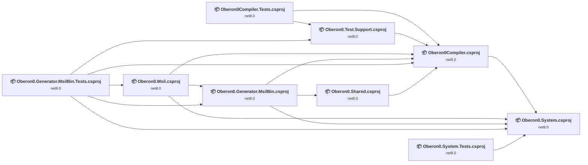
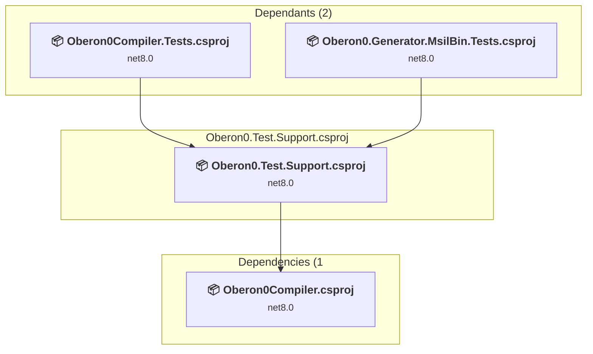
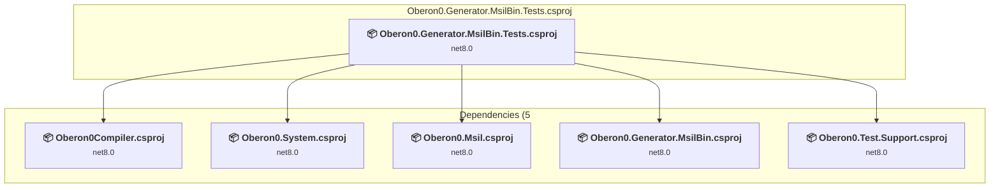
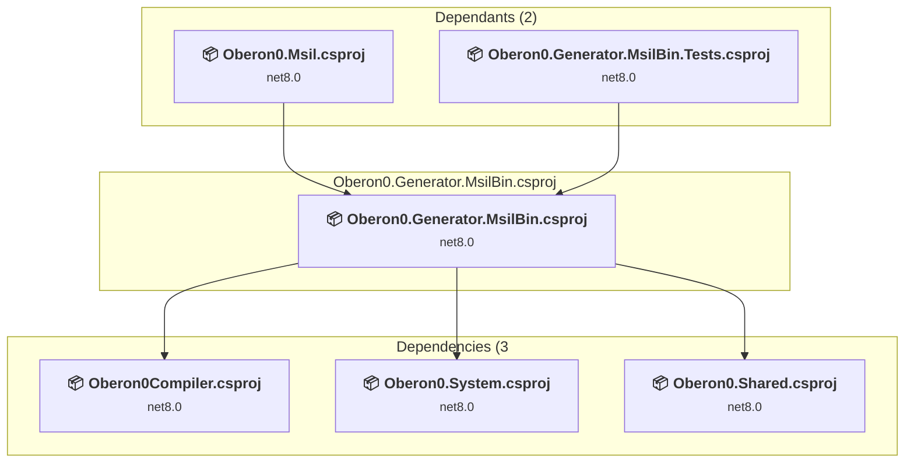
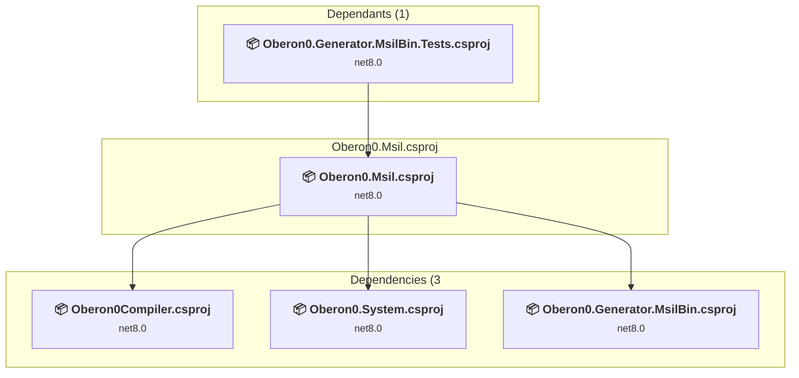
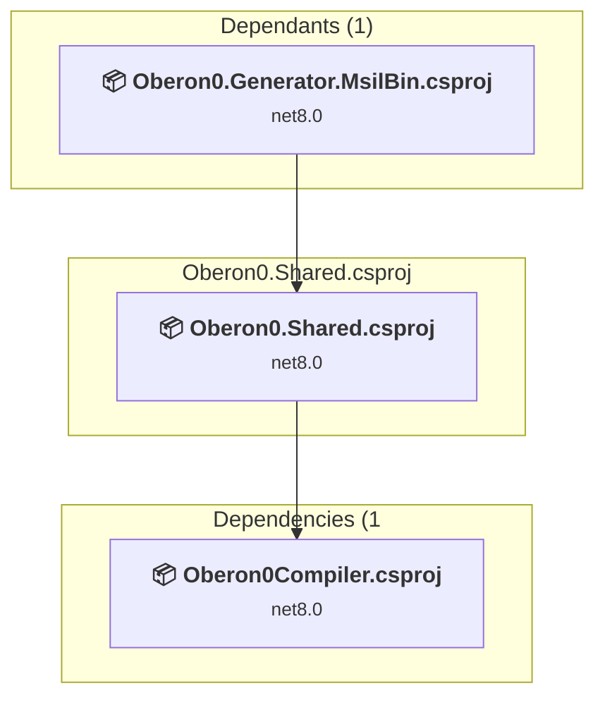
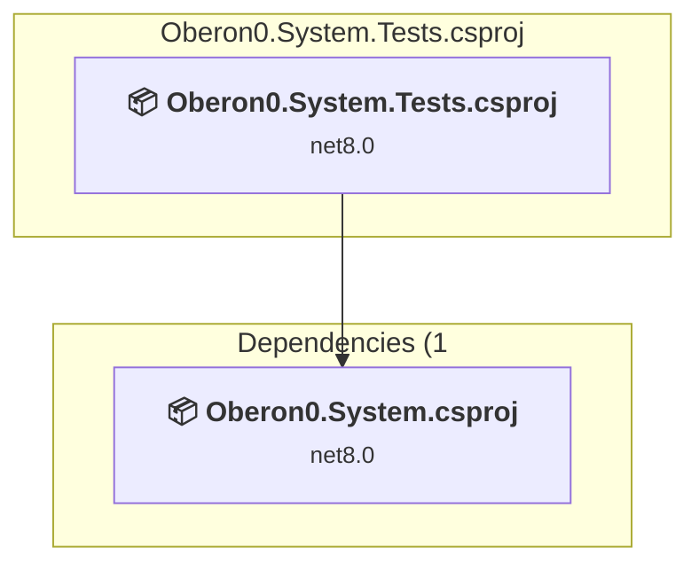
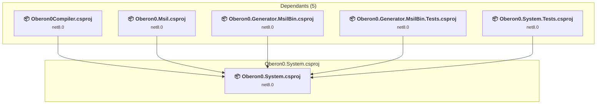
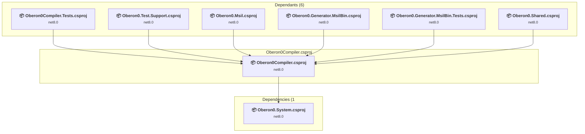
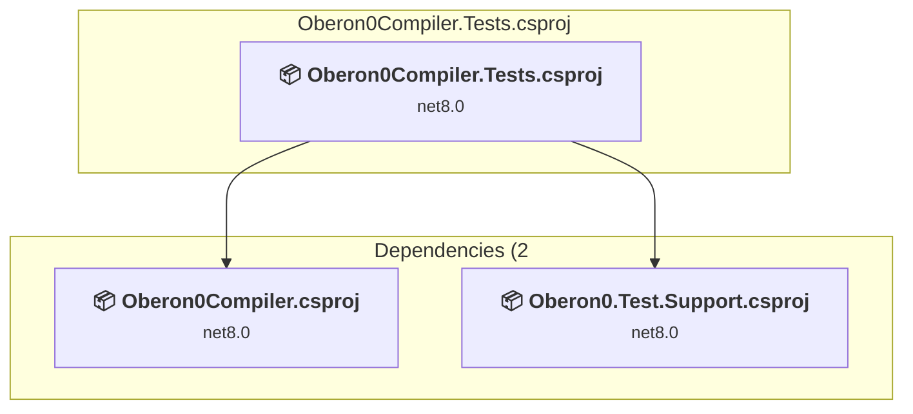

# Projects and dependencies analysis

This document provides a comprehensive overview of the projects and their dependencies in the context of upgrading to .NETCoreApp,Version=v10.0.

## Table of Contents

- [Executive Summary](#executive-Summary)
  - [Highlevel Metrics](#highlevel-metrics)
  - [Projects Compatibility](#projects-compatibility)
  - [Package Compatibility](#package-compatibility)
  - [API Compatibility](#api-compatibility)
- [Aggregate NuGet packages details](#aggregate-nuget-packages-details)
- [Top API Migration Challenges](#top-api-migration-challenges)
  - [Technologies and Features](#technologies-and-features)
  - [Most Frequent API Issues](#most-frequent-api-issues)
- [Projects Relationship Graph](#projects-relationship-graph)
- [Project Details](#project-details)

  - [Oberon0.CompilerSupport\Oberon0.Test.Support.csproj](#oberon0compilersupportoberon0testsupportcsproj)
  - [Oberon0.Generator.MsilBin.Tests\Oberon0.Generator.MsilBin.Tests.csproj](#oberon0generatormsilbintestsoberon0generatormsilbintestscsproj)
  - [Oberon0.Generator.MsilBin\Oberon0.Generator.MsilBin.csproj](#oberon0generatormsilbinoberon0generatormsilbincsproj)
  - [Oberon0.Msil\Oberon0.Msil.csproj](#oberon0msiloberon0msilcsproj)
  - [Oberon0.Shared\Oberon0.Shared.csproj](#oberon0sharedoberon0sharedcsproj)
  - [Oberon0.System.Tests\Oberon0.System.Tests.csproj](#oberon0systemtestsoberon0systemtestscsproj)
  - [Oberon0.System\Oberon0.System.csproj](#oberon0systemoberon0systemcsproj)
  - [oberon0\Oberon0Compiler.csproj](#oberon0oberon0compilercsproj)
  - [UnitTestProject1\Oberon0Compiler.Tests.csproj](#unittestproject1oberon0compilertestscsproj)

## Executive Summary

### Highlevel Metrics

| Metric | Count | Status |
| :--- | :---: | :--- |
| Total Projects | 9 | All require upgrade |
| Total NuGet Packages | 13 | 1 need upgrade |
| Total Code Files | 151 |  |
| Total Code Files with Incidents | 24 |  |
| Total Lines of Code | 13690 |  |
| Total Number of Issues | 73 |  |
| Estimated LOC to modify | 51+ | at least 0,4% of codebase |

### Projects Compatibility

| Project | Target Framework | Difficulty | Package Issues | API Issues | Est. LOC Impact | Description |
| :--- | :---: | :---: | :---: | :---: | :---: | :--- |
| [Oberon0.CompilerSupport\Oberon0.Test.Support.csproj](#oberon0compilersupportoberon0testsupportcsproj) | net8.0 | 🟢 Low | 2 | 0 |  | ClassLibrary, Sdk Style = True |
| [Oberon0.Generator.MsilBin.Tests\Oberon0.Generator.MsilBin.Tests.csproj](#oberon0generatormsilbintestsoberon0generatormsilbintestscsproj) | net8.0 | 🟢 Low | 2 | 0 |  | DotNetCoreApp, Sdk Style = True |
| [Oberon0.Generator.MsilBin\Oberon0.Generator.MsilBin.csproj](#oberon0generatormsilbinoberon0generatormsilbincsproj) | net8.0 | 🟢 Low | 1 | 14 | 14+ | ClassLibrary, Sdk Style = True |
| [Oberon0.Msil\Oberon0.Msil.csproj](#oberon0msiloberon0msilcsproj) | net8.0 | 🟢 Low | 1 | 11 | 11+ | DotNetCoreApp, Sdk Style = True |
| [Oberon0.Shared\Oberon0.Shared.csproj](#oberon0sharedoberon0sharedcsproj) | net8.0 | 🟢 Low | 1 | 0 |  | ClassLibrary, Sdk Style = True |
| [Oberon0.System.Tests\Oberon0.System.Tests.csproj](#oberon0systemtestsoberon0systemtestscsproj) | net8.0 | 🟢 Low | 2 | 0 |  | DotNetCoreApp, Sdk Style = True |
| [Oberon0.System\Oberon0.System.csproj](#oberon0systemoberon0systemcsproj) | net8.0 | 🟢 Low | 1 | 0 |  | ClassLibrary, Sdk Style = True |
| [oberon0\Oberon0Compiler.csproj](#oberon0oberon0compilercsproj) | net8.0 | 🟢 Low | 1 | 26 | 26+ | ClassLibrary, Sdk Style = True |
| [UnitTestProject1\Oberon0Compiler.Tests.csproj](#unittestproject1oberon0compilertestscsproj) | net8.0 | 🟢 Low | 2 | 0 |  | DotNetCoreApp, Sdk Style = True |

### Package Compatibility

| Status | Count | Percentage |
| :--- | :---: | :---: |
| ✅ Compatible | 12 | 92,3% |
| ⚠️ Incompatible | 1 | 7,7% |
| 🔄 Upgrade Recommended | 0 | 0,0% |
| ***Total NuGet Packages*** | ***13*** | ***100%*** |

### API Compatibility

| Category | Count | Impact |
| :--- | :---: | :--- |
| 🔴 Binary Incompatible | 0 | High - Require code changes |
| 🟡 Source Incompatible | 51 | Medium - Needs re-compilation and potential conflicting API error fixing |
| 🔵 Behavioral change | 0 | Low - Behavioral changes that may require testing at runtime |
| ✅ Compatible | 19651 |  |
| ***Total APIs Analyzed*** | ***19702*** |  |

## Aggregate NuGet packages details

| Package | Current Version | Suggested Version | Projects | Description |
| :--- | :---: | :---: | :--- | :--- |
| Antlr4.Runtime.Standard | 4.13.1 |  | [Oberon0.Test.Support.csproj](#oberon0compilersupportoberon0testsupportcsproj) [Oberon0Compiler.csproj](#oberon0oberon0compilercsproj) | ✅Compatible |
| Antlr4BuildTasks | 12.14.0 |  | [Oberon0.Test.Support.csproj](#oberon0compilersupportoberon0testsupportcsproj) [Oberon0Compiler.csproj](#oberon0oberon0compilercsproj) | ✅Compatible |
| AnyClone | 1.1.6 |  | [Oberon0.Generator.MsilBin.csproj](#oberon0generatormsilbinoberon0generatormsilbincsproj) | ✅Compatible |
| coverlet.collector | 6.0.4 |  | [Oberon0.Generator.MsilBin.Tests.csproj](#oberon0generatormsilbintestsoberon0generatormsilbintestscsproj) [Oberon0.System.Tests.csproj](#oberon0systemtestsoberon0systemtestscsproj) [Oberon0Compiler.Tests.csproj](#unittestproject1oberon0compilertestscsproj) | ✅Compatible |
| JetBrains.Annotations | 2025.2.4 |  | [Oberon0.Test.Support.csproj](#oberon0compilersupportoberon0testsupportcsproj) [Oberon0Compiler.csproj](#oberon0oberon0compilercsproj) | ✅Compatible |
| Microsoft.CodeAnalysis.CSharp | 5.0.0 |  | [Oberon0.Generator.MsilBin.csproj](#oberon0generatormsilbinoberon0generatormsilbincsproj) [Oberon0.Shared.csproj](#oberon0sharedoberon0sharedcsproj) | ✅Compatible |
| Microsoft.CodeAnalysis.CSharp.Workspaces | 5.0.0 |  | [Oberon0.Generator.MsilBin.csproj](#oberon0generatormsilbinoberon0generatormsilbincsproj) | ✅Compatible |
| Microsoft.Extensions.DependencyModel | 10.0.2 |  | [Oberon0.Generator.MsilBin.Tests.csproj](#oberon0generatormsilbintestsoberon0generatormsilbintestscsproj) [Oberon0.Msil.csproj](#oberon0msiloberon0msilcsproj) [Oberon0.Shared.csproj](#oberon0sharedoberon0sharedcsproj) | ✅Compatible |
| Microsoft.NET.Test.Sdk | 18.0.1 |  | [Oberon0.Generator.MsilBin.Tests.csproj](#oberon0generatormsilbintestsoberon0generatormsilbintestscsproj) [Oberon0.System.Tests.csproj](#oberon0systemtestsoberon0systemtestscsproj) [Oberon0Compiler.Tests.csproj](#unittestproject1oberon0compilertestscsproj) | ✅Compatible |
| System.CommandLine | 2.0.2 |  | [Oberon0.Msil.csproj](#oberon0msiloberon0msilcsproj) | ✅Compatible |
| System.Composition.TypedParts | 10.0.2 |  | [Oberon0Compiler.csproj](#oberon0oberon0compilercsproj) | ✅Compatible |
| xunit | 2.9.3 |  | [Oberon0.Generator.MsilBin.Tests.csproj](#oberon0generatormsilbintestsoberon0generatormsilbintestscsproj) [Oberon0.System.Tests.csproj](#oberon0systemtestsoberon0systemtestscsproj) [Oberon0.Test.Support.csproj](#oberon0compilersupportoberon0testsupportcsproj) [Oberon0Compiler.Tests.csproj](#unittestproject1oberon0compilertestscsproj) | ⚠️Das NuGet-Paket ist veraltet |
| xunit.runner.visualstudio | 3.1.5 |  | [Oberon0.Generator.MsilBin.Tests.csproj](#oberon0generatormsilbintestsoberon0generatormsilbintestscsproj) [Oberon0.System.Tests.csproj](#oberon0systemtestsoberon0systemtestscsproj) [Oberon0Compiler.Tests.csproj](#unittestproject1oberon0compilertestscsproj) | ✅Compatible |

## Top API Migration Challenges

### Technologies and Features

| Technology | Issues | Percentage | Migration Path |
| :--- | :---: | :---: | :--- |

### Most Frequent API Issues

| API | Count | Percentage | Category |
| :--- | :---: | :---: | :--- |
| M:System.Composition.ExportAttribute.#ctor(System.Type) | 8 | 15,7% | Source Incompatible |
| T:System.Composition.Hosting.ContainerConfiguration | 6 | 11,8% | Source Incompatible |
| T:System.Composition.Hosting.CompositionHost | 5 | 9,8% | Source Incompatible |
| M:System.CommandLine.Command.Add(System.CommandLine.Option) | 4 | 7,8% | Source Incompatible |
| M:System.Composition.CompositionContext.GetExports''1 | 3 | 5,9% | Source Incompatible |
| M:System.Composition.Hosting.ContainerConfiguration.CreateContainer | 3 | 5,9% | Source Incompatible |
| M:System.Composition.Hosting.ContainerConfiguration.#ctor | 3 | 5,9% | Source Incompatible |
| M:System.Composition.Hosting.ContainerConfiguration.WithAssembly(System.Reflection.Assembly) | 3 | 5,9% | Source Incompatible |
| M:System.Composition.MetadataAttributeAttribute.#ctor | 3 | 5,9% | Source Incompatible |
| T:System.Composition.MetadataAttributeAttribute | 3 | 5,9% | Source Incompatible |
| T:System.Composition.ExportAttribute | 3 | 5,9% | Source Incompatible |
| T:System.CommandLine.ArgumentArity | 3 | 5,9% | Source Incompatible |
| T:System.CommandLine.RootCommand | 1 | 2,0% | Source Incompatible |
| M:System.CommandLine.RootCommand.#ctor(System.String) | 1 | 2,0% | Source Incompatible |
| P:System.CommandLine.ArgumentArity.ExactlyOne | 1 | 2,0% | Source Incompatible |
| P:System.CommandLine.Argument.Arity | 1 | 2,0% | Source Incompatible |

## Projects Relationship Graph

Legend:
📦 SDK-style project
⚙️ Classic project

## Project Details

### Oberon0.CompilerSupport\Oberon0.Test.Support.csproj

#### Project Info

- **Current Target Framework:** net8.0
- **Proposed Target Framework:** net10.0
- **SDK-style**: True
- **Project Kind:** ClassLibrary
- **Dependencies**: 1
- **Dependants**: 2
- **Number of Files**: 3
- **Number of Files with Incidents**: 2
- **Lines of Code**: 212
- **Estimated LOC to modify**: 0+ (at least 0,0% of the project)

#### Dependency Graph

Legend:
📦 SDK-style project
⚙️ Classic project

### API Compatibility

| Category | Count | Impact |
| :--- | :---: | :--- |
| 🔴 Binary Incompatible | 0 | High - Require code changes |
| 🟡 Source Incompatible | 0 | Medium - Needs re-compilation and potential conflicting API error fixing |
| 🔵 Behavioral change | 0 | Low - Behavioral changes that may require testing at runtime |
| ✅ Compatible | 106 |  |
| ***Total APIs Analyzed*** | ***106*** |  |

### Oberon0.Generator.MsilBin.Tests\Oberon0.Generator.MsilBin.Tests.csproj

#### Project Info

- **Current Target Framework:** net8.0
- **Proposed Target Framework:** net10.0
- **SDK-style**: True
- **Project Kind:** DotNetCoreApp
- **Dependencies**: 5
- **Dependants**: 0
- **Number of Files**: 24
- **Number of Files with Incidents**: 2
- **Lines of Code**: 2503
- **Estimated LOC to modify**: 0+ (at least 0,0% of the project)

#### Dependency Graph

Legend:
📦 SDK-style project
⚙️ Classic project

### API Compatibility

| Category | Count | Impact |
| :--- | :---: | :--- |
| 🔴 Binary Incompatible | 0 | High - Require code changes |
| 🟡 Source Incompatible | 0 | Medium - Needs re-compilation and potential conflicting API error fixing |
| 🔵 Behavioral change | 0 | Low - Behavioral changes that may require testing at runtime |
| ✅ Compatible | 1811 |  |
| ***Total APIs Analyzed*** | ***1811*** |  |

### Oberon0.Generator.MsilBin\Oberon0.Generator.MsilBin.csproj

#### Project Info

- **Current Target Framework:** net8.0
- **Proposed Target Framework:** net10.0
- **SDK-style**: True
- **Project Kind:** ClassLibrary
- **Dependencies**: 3
- **Dependants**: 2
- **Number of Files**: 22
- **Number of Files with Incidents**: 4
- **Lines of Code**: 1908
- **Estimated LOC to modify**: 14+ (at least 0,7% of the project)

#### Dependency Graph

Legend:
📦 SDK-style project
⚙️ Classic project

### API Compatibility

| Category | Count | Impact |
| :--- | :---: | :--- |
| 🔴 Binary Incompatible | 0 | High - Require code changes |
| 🟡 Source Incompatible | 14 | Medium - Needs re-compilation and potential conflicting API error fixing |
| 🔵 Behavioral change | 0 | Low - Behavioral changes that may require testing at runtime |
| ✅ Compatible | 2119 |  |
| ***Total APIs Analyzed*** | ***2133*** |  |

### Oberon0.Msil\Oberon0.Msil.csproj

#### Project Info

- **Current Target Framework:** net8.0
- **Proposed Target Framework:** net10.0
- **SDK-style**: True
- **Project Kind:** DotNetCoreApp
- **Dependencies**: 3
- **Dependants**: 1
- **Number of Files**: 2
- **Number of Files with Incidents**: 3
- **Lines of Code**: 158
- **Estimated LOC to modify**: 11+ (at least 7,0% of the project)

#### Dependency Graph

Legend:
📦 SDK-style project
⚙️ Classic project

### API Compatibility

| Category | Count | Impact |
| :--- | :---: | :--- |
| 🔴 Binary Incompatible | 0 | High - Require code changes |
| 🟡 Source Incompatible | 11 | Medium - Needs re-compilation and potential conflicting API error fixing |
| 🔵 Behavioral change | 0 | Low - Behavioral changes that may require testing at runtime |
| ✅ Compatible | 83 |  |
| ***Total APIs Analyzed*** | ***94*** |  |

### Oberon0.Shared\Oberon0.Shared.csproj

#### Project Info

- **Current Target Framework:** net8.0
- **Proposed Target Framework:** net10.0
- **SDK-style**: True
- **Project Kind:** ClassLibrary
- **Dependencies**: 1
- **Dependants**: 1
- **Number of Files**: 5
- **Number of Files with Incidents**: 2
- **Lines of Code**: 259
- **Estimated LOC to modify**: 0+ (at least 0,0% of the project)

#### Dependency Graph

Legend:
📦 SDK-style project
⚙️ Classic project

### API Compatibility

| Category | Count | Impact |
| :--- | :---: | :--- |
| 🔴 Binary Incompatible | 0 | High - Require code changes |
| 🟡 Source Incompatible | 0 | Medium - Needs re-compilation and potential conflicting API error fixing |
| 🔵 Behavioral change | 0 | Low - Behavioral changes that may require testing at runtime |
| ✅ Compatible | 166 |  |
| ***Total APIs Analyzed*** | ***166*** |  |

### Oberon0.System.Tests\Oberon0.System.Tests.csproj

#### Project Info

- **Current Target Framework:** net8.0
- **Proposed Target Framework:** net10.0
- **SDK-style**: True
- **Project Kind:** DotNetCoreApp
- **Dependencies**: 1
- **Dependants**: 0
- **Number of Files**: 4
- **Number of Files with Incidents**: 2
- **Lines of Code**: 168
- **Estimated LOC to modify**: 0+ (at least 0,0% of the project)

#### Dependency Graph

Legend:
📦 SDK-style project
⚙️ Classic project

### API Compatibility

| Category | Count | Impact |
| :--- | :---: | :--- |
| 🔴 Binary Incompatible | 0 | High - Require code changes |
| 🟡 Source Incompatible | 0 | Medium - Needs re-compilation and potential conflicting API error fixing |
| 🔵 Behavioral change | 0 | Low - Behavioral changes that may require testing at runtime |
| ✅ Compatible | 239 |  |
| ***Total APIs Analyzed*** | ***239*** |  |

### Oberon0.System\Oberon0.System.csproj

#### Project Info

- **Current Target Framework:** net8.0
- **Proposed Target Framework:** net10.0
- **SDK-style**: True
- **Project Kind:** ClassLibrary
- **Dependencies**: 0
- **Dependants**: 5
- **Number of Files**: 6
- **Number of Files with Incidents**: 2
- **Lines of Code**: 322
- **Estimated LOC to modify**: 0+ (at least 0,0% of the project)

#### Dependency Graph

Legend:
📦 SDK-style project
⚙️ Classic project

### API Compatibility

| Category | Count | Impact |
| :--- | :---: | :--- |
| 🔴 Binary Incompatible | 0 | High - Require code changes |
| 🟡 Source Incompatible | 0 | Medium - Needs re-compilation and potential conflicting API error fixing |
| 🔵 Behavioral change | 0 | Low - Behavioral changes that may require testing at runtime |
| ✅ Compatible | 123 |  |
| ***Total APIs Analyzed*** | ***123*** |  |

### oberon0\Oberon0Compiler.csproj

#### Project Info

- **Current Target Framework:** net8.0
- **Proposed Target Framework:** net10.0
- **SDK-style**: True
- **Project Kind:** ClassLibrary
- **Dependencies**: 1
- **Dependants**: 6
- **Number of Files**: 65
- **Number of Files with Incidents**: 5
- **Lines of Code**: 3907
- **Estimated LOC to modify**: 26+ (at least 0,7% of the project)

#### Dependency Graph

Legend:
📦 SDK-style project
⚙️ Classic project

### API Compatibility

| Category | Count | Impact |
| :--- | :---: | :--- |
| 🔴 Binary Incompatible | 0 | High - Require code changes |
| 🟡 Source Incompatible | 26 | Medium - Needs re-compilation and potential conflicting API error fixing |
| 🔵 Behavioral change | 0 | Low - Behavioral changes that may require testing at runtime |
| ✅ Compatible | 9350 |  |
| ***Total APIs Analyzed*** | ***9376*** |  |

### UnitTestProject1\Oberon0Compiler.Tests.csproj

#### Project Info

- **Current Target Framework:** net8.0
- **Proposed Target Framework:** net10.0
- **SDK-style**: True
- **Project Kind:** DotNetCoreApp
- **Dependencies**: 2
- **Dependants**: 0
- **Number of Files**: 26
- **Number of Files with Incidents**: 2
- **Lines of Code**: 4253
- **Estimated LOC to modify**: 0+ (at least 0,0% of the project)

#### Dependency Graph

Legend:
📦 SDK-style project
⚙️ Classic project

### API Compatibility

| Category | Count | Impact |
| :--- | :---: | :--- |
| 🔴 Binary Incompatible | 0 | High - Require code changes |
| 🟡 Source Incompatible | 0 | Medium - Needs re-compilation and potential conflicting API error fixing |
| 🔵 Behavioral change | 0 | Low - Behavioral changes that may require testing at runtime |
| ✅ Compatible | 5654 |  |
| ***Total APIs Analyzed*** | ***5654*** |  |

